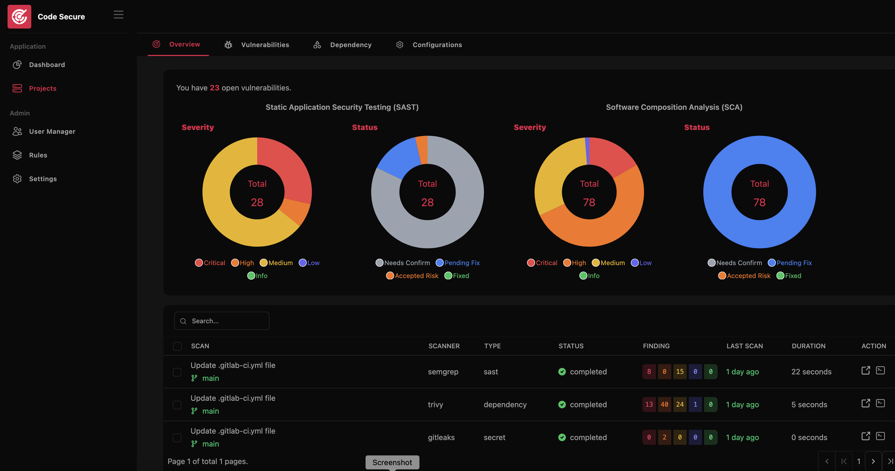
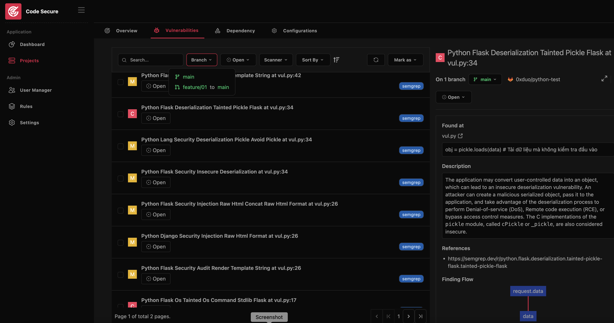

# Code Secure Dashboard

Code Secure is a comprehensive tool for DevSecOps, ASPM (Application Security Posture Management), and vulnerability management. It streamlines the entire process of security testing, tracking vulnerabilities, deduplication, remediation, with built-in support for integration into CI/CD pipelines.

## Documentation

- [Installation](docs/installation.md)
- [Authentication](docs/authentication.md)
- [Notification](docs/notification.md)
- [CICD Integration](docs/cicd.md)

## Demo
1. Project Overview

2. Project Findings

