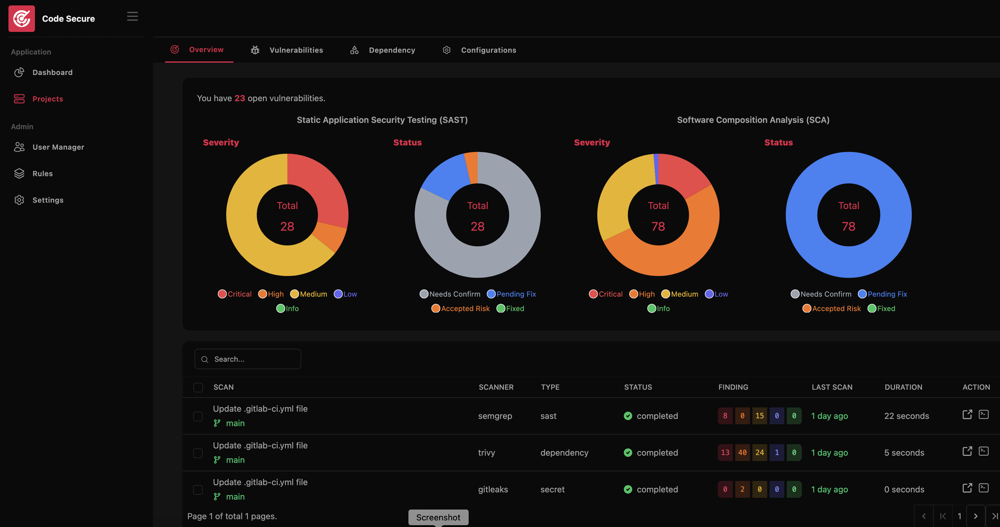
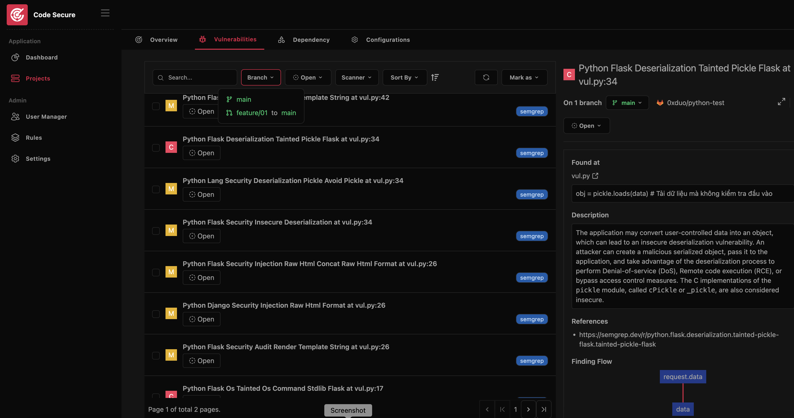
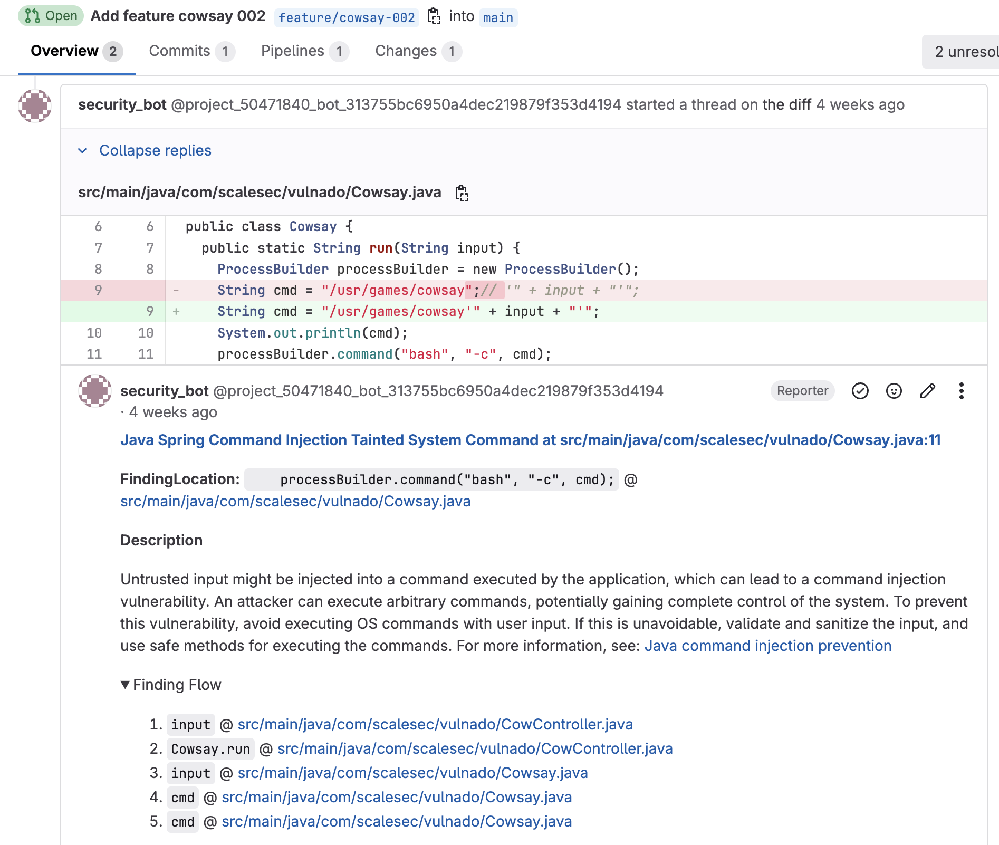
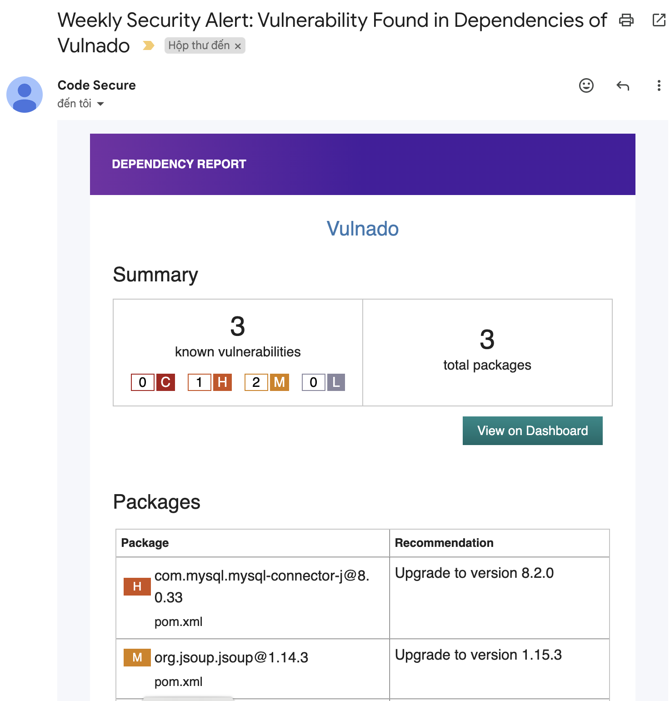

# Code Secure Dashboard

Code Secure is a comprehensive tool for DevSecOps, ASPM (Application Security Posture Management), and vulnerability management. It streamlines the entire process of security testing, tracking vulnerabilities, deduplication, remediation, with built-in support for integration into CI/CD pipelines.

## Documentation

https://califio.github.io/code-secure-dashboard

## Demo
1. Project Overview

2. Project Findings

3. Comment On Merge Request

4. Weekly security alert

