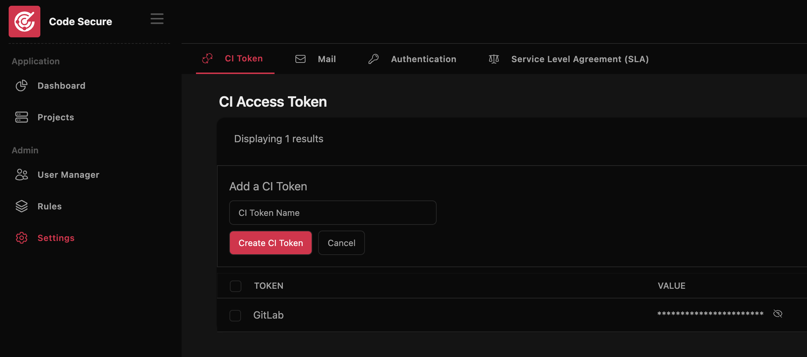
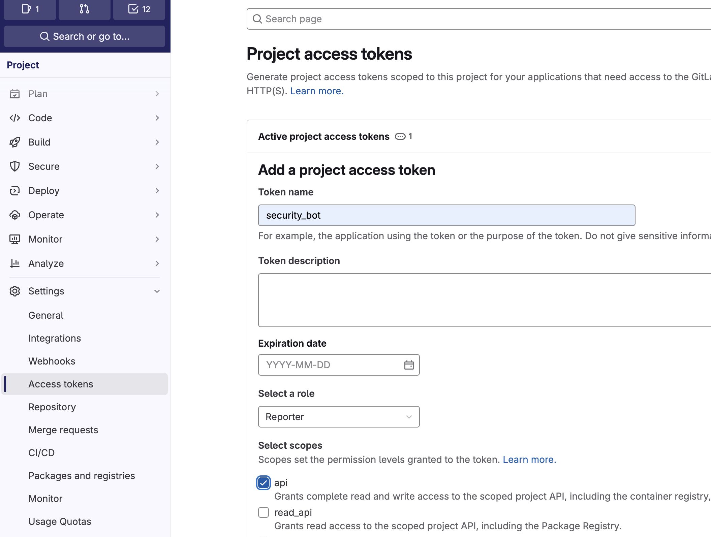

# CICD Integration

Currently, we support integration with the following open-source scanners:

- **Static Application Security Testing (SAST)**: [Semgrep](https://github.com/semgrep/semgrep) 
- **Software Composition Analysis (SCA)**: [Trivy](https://github.com/aquasecurity/trivy)
- **Secret Detection**: [Gitleaks](https://github.com/gitleaks/gitleaks)

## Prepare Environment

In the CI pipeline, the analyzer scans, parses the results, and uploads them to the Code Secure Dashboard. An access token is required for authentication with the Code Secure Dashboard. The following are the required environment variables.

| ENV               | Require  | Description                                                                        |
|-------------------|----------|------------------------------------------------------------------------------------|
| CODE_SECURE_URL   | true     | The URL of code secure dashboard. Example: https://finding.example.com             |
| CODE_SECURE_TOKEN | true     | The CI token used for authentication with the Code Secure Dashboard.               |
| GITLAB_TOKEN      | optional | The GitLab token used to comment on merge requests when new findings are detected. |

#### How to get CODE_SECURE_TOKEN
Go to **Settings > CI Token** in the Code Secure Dashboard and create a new CI token if it does not already exist.



#### How to get GITLAB_TOKEN
Go to **Settings > Access Tokens** in the GitLab group or project and create a GitLab access token with the role **Reporter** and the **api** scope.



## Integrate with GitLab CI

### Semgrep

We developed [semgrep-analyzer](https://gitlab.com/code-secure/semgrep-analyzer) based on Semgrep, enabling you to fully utilize [Semgrep’s environment](https://semgrep.dev/docs/semgrep-ci/ci-environment-variables).

GitLab pipeline example:

```yaml
semgrep-sast-scan:
 image: ghcr.io/califio/code-secure-semgrep:latest
 variables:
   SEMGREP_RULES: ""
   SEMGREP_APP_TOKEN: "foo"
   SEMGREP_PRO: "true"
 rules:
 - if: $CI_PIPELINE_SOURCE == "web"
 - if: $CI_MERGE_REQUEST_IID
 - if: $CI_COMMIT_BRANCH == $CI_DEFAULT_BRANCH
 - if: $CI_COMMIT_TAG
 script:
   - /analyzer run
```

### Trivy

```yaml
trivy-dependency-scan:
 stage: test
 rules:
 - if: $CI_PIPELINE_SOURCE == "web"
 - if: $CI_MERGE_REQUEST_IID
 - if: $CI_COMMIT_BRANCH == $CI_DEFAULT_BRANCH
 - if: $CI_COMMIT_TAG
 image: ghcr.io/califio/code-secure-trivy:latest
 script:
   - /analyzer dependency
```

### Gitleaks

```yaml
secret-detection:
  image: ghcr.io/califio/code-secure-gitleaks:latest
  stage: test
  rules:
    - if: $CI_PIPELINE_SOURCE == "web"
    - if: $CI_MERGE_REQUEST_IID
    - if: $CI_COMMIT_BRANCH == $CI_DEFAULT_BRANCH
    - if: $CI_COMMIT_TAG
  script:
    - /analyzer run
```
