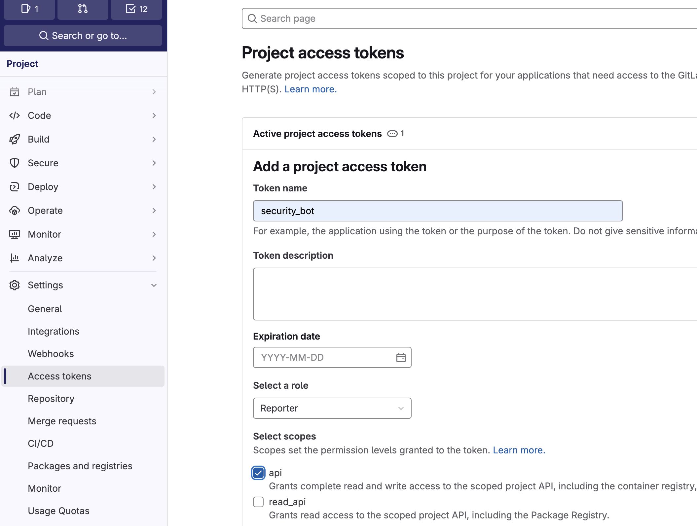

# Environment Variables

In the CI pipeline, the analyzer scans, parses the results, and uploads them to the Code Secure Dashboard. 
An access token is required for authentication with the Code Secure Dashboard. 

The following are the required environment variables.

| ENV               | Require  | Description                                                                        |
|-------------------|----------|------------------------------------------------------------------------------------|
| CODE_SECURE_URL   | true     | The URL of code secure dashboard. Example: https://finding.example.com             |
| CODE_SECURE_TOKEN | true     | The CI Access Token used for authentication with the Code Secure Dashboard.        |
| GITLAB_TOKEN      | optional | The GitLab token used to comment on merge requests when new findings are detected. |

??? question "How to get GITLAB_TOKEN?"

    Go to **Settings > Access Tokens** in the GitLab project and create a GitLab access token with the role **Reporter** and the **api** scope.

    