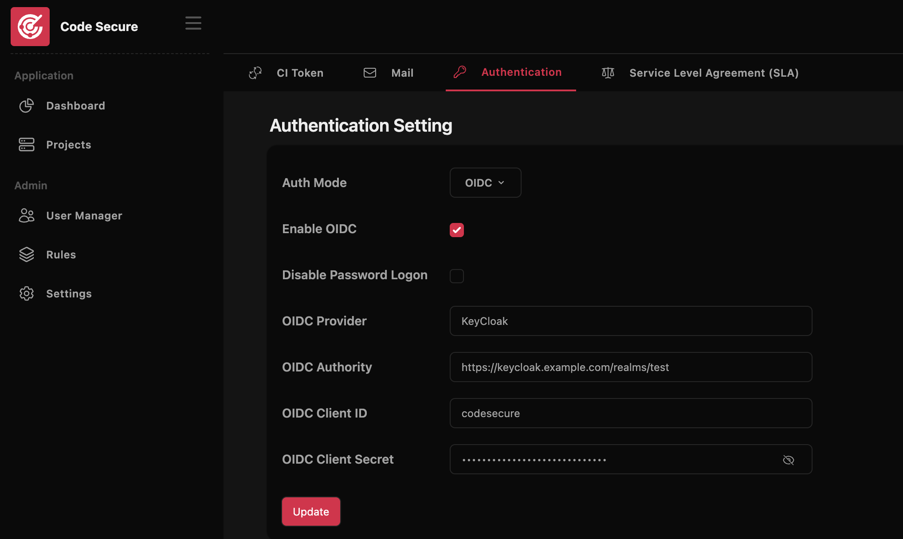

# Authentication

Currently, Code Secure supports password logon and Open ID Connect. 
To configure authentication. Log in to admin account and go to **Setting > Authentication**

### Open ID Connect Setting

