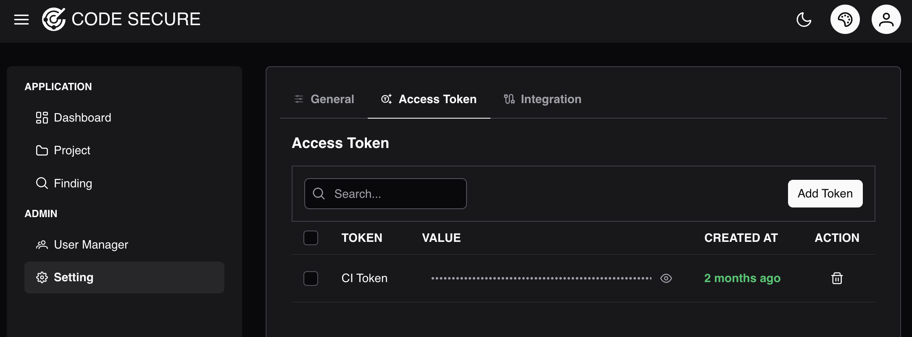

# CI Access Token
The CI Token is an access token used by scanner tools to communicate with the Code Secure Dashboard.

To manage the **CI Access Token**. Log in to admin account and navigate to **Setting > Access Token**

