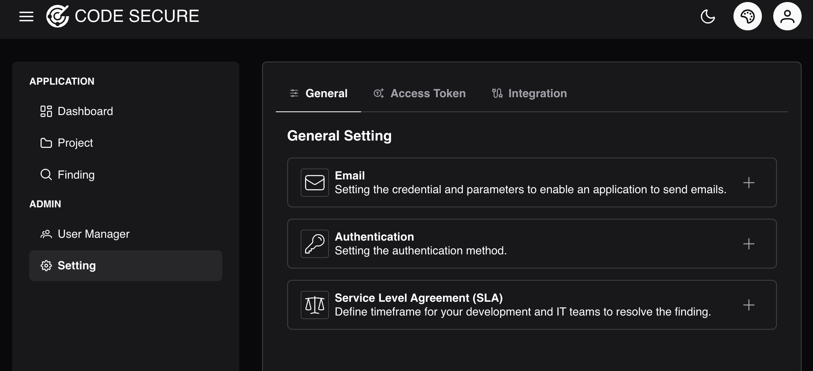
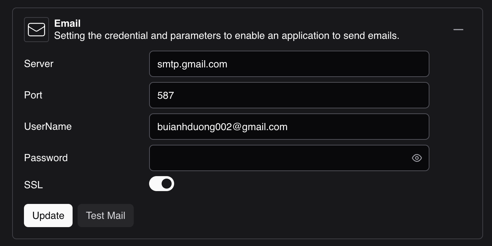
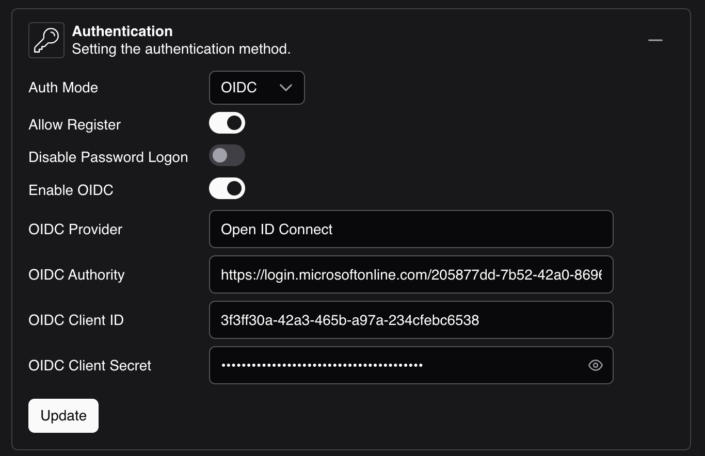
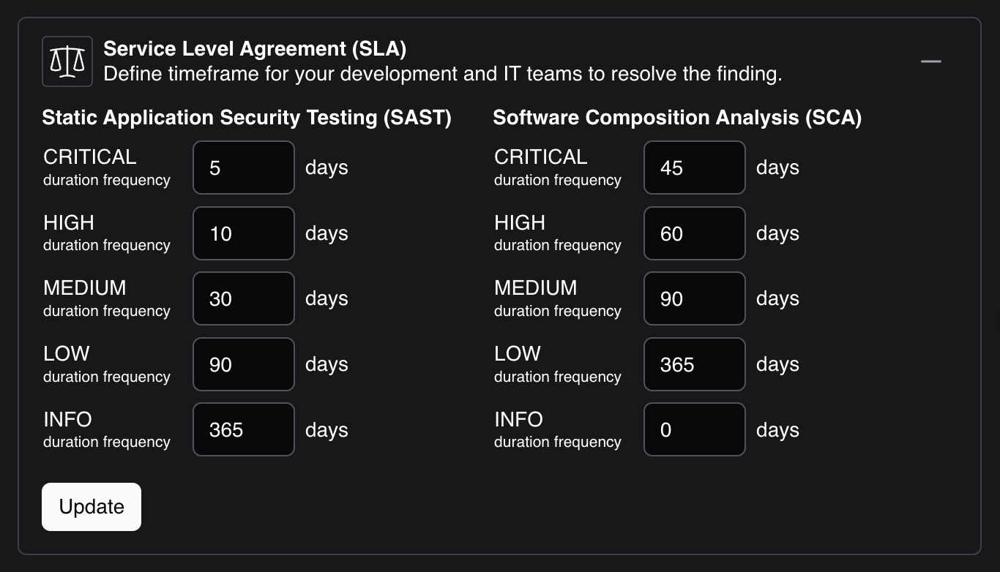

# General
To configure notifications. Log in to admin account and go to **Setting > General**

### Mail <small>required</small>
Mail notifications serve as the official communication channel, allowing the system to deliver all important notifications directly to users

In the **Email** section, fill in the following details:

  - **Server:** SMTP server (e.g., `smtp.gmail.com`)
  - **Port:** SMTP port (e.g., `587` or `465`)
  - **Username:** Your email address (e.g., `example@gmail.com`).
  - **Password:** Your email account password.

### Authentication
Currently, Code Secure supports password logon and Open ID Connect.

**Open ID Connect Setting**

### Service Level Agreement (SLA)
Define timeframe for your development and IT teams to resolve the finding.

