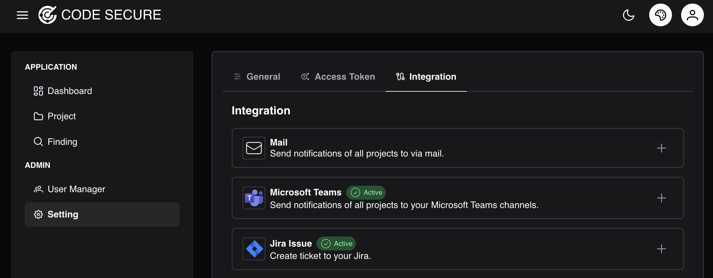
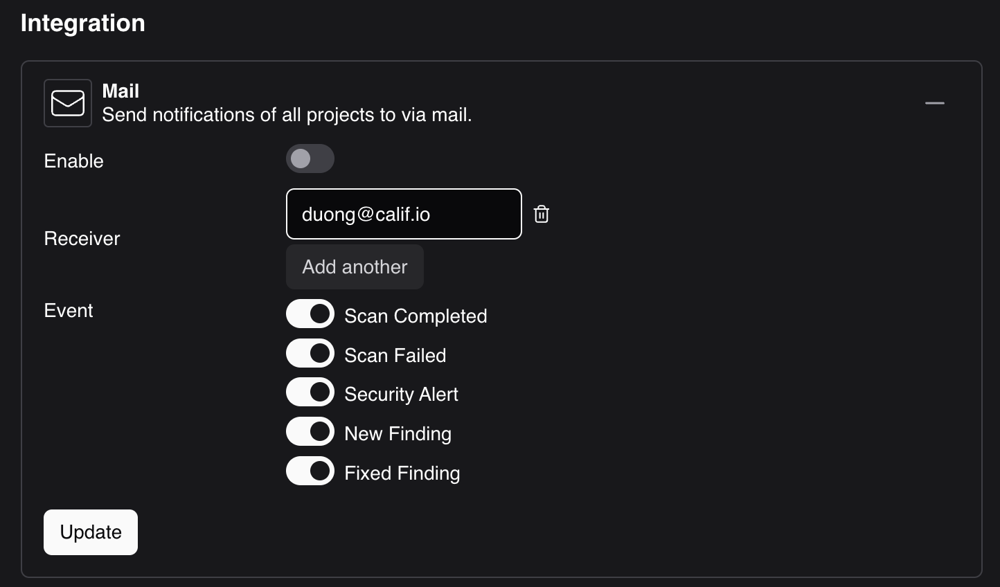
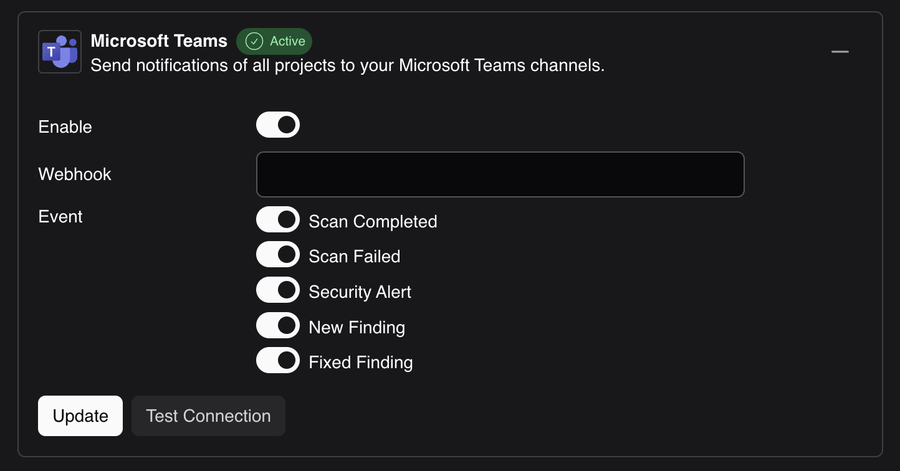
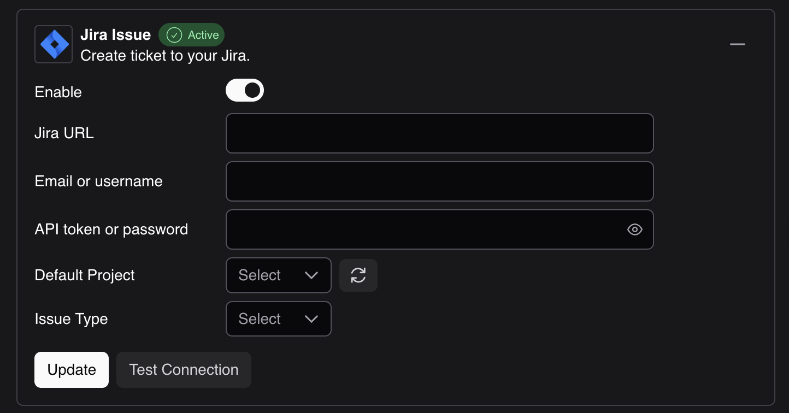

# General
To configure integration. Log in to admin account and go to **Setting > Integration**

### Mail
Mail notifications allow event alerts to be delivered to specific users.

### Microsoft Teams

Connect [Microsoft Teams WebHook](https://learn.microsoft.com/en-us/microsoftteams/platform/webhooks-and-connectors/how-to/add-incoming-webhook?tabs=newteams%2Cdotnet) to send notifications to your Microsoft Teams channels.

Microsoft Teams notifications allow for the delivery of special alerts and are recommended for use by the security team.

### Jira
Integrating Jira allows for the automatic creation of tickets when a finding requires action.
