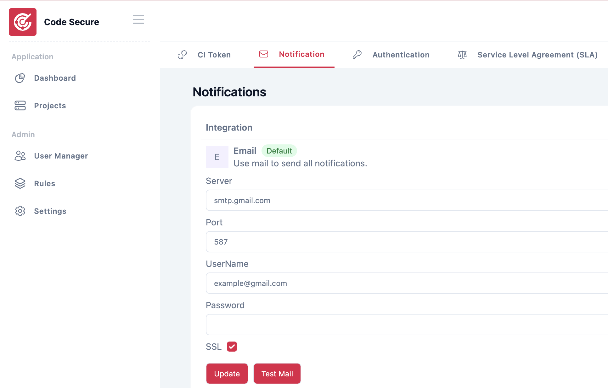
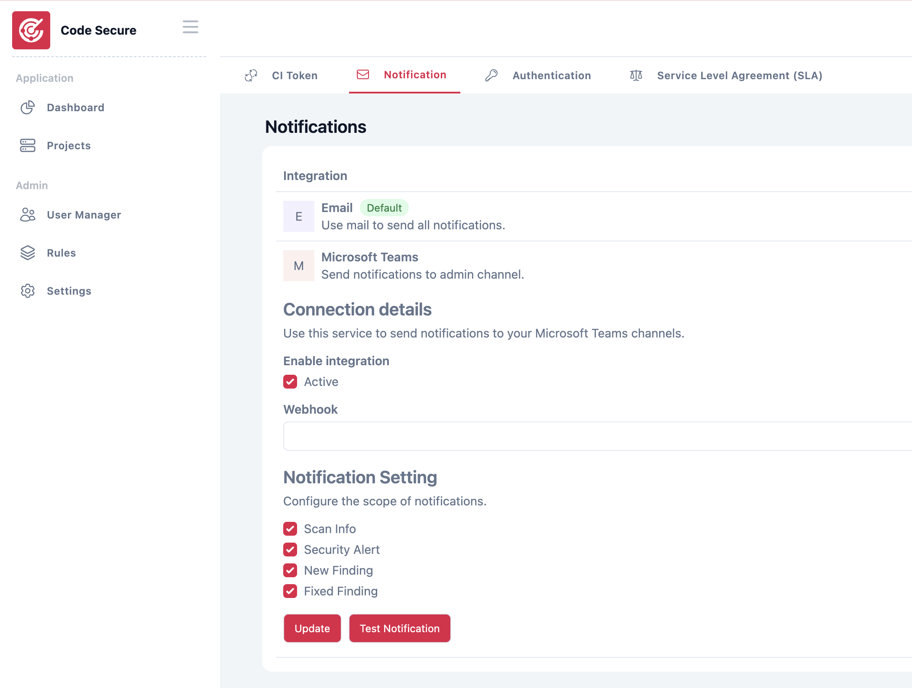

# Notification

This section provides instructions for setting up notifications to ensure you receive important updates and alerts through your preferred channels.

To configure notifications. Log in to admin account and go to **Setting > Notification**
### Email <small>required</small>
Email notifications serve as the official communication channel, allowing the system to deliver all important notifications directly to users.

In the **Mail Setting** section, fill in the following details:

  - **Server:** SMTP server (e.g., `smtp.gmail.com`)
  - **Port:** SMTP port (e.g., `587` or `465`)
  - **Username:** Your email address (e.g., `example@gmail.com`).
  - **Password:** Your email account password.

### Microsoft Teams

Connect [Microsoft Teams WebHook](https://learn.microsoft.com/en-us/microsoftteams/platform/webhooks-and-connectors/how-to/add-incoming-webhook?tabs=newteams%2Cdotnet) to send notifications to your Microsoft Teams channels.

Microsoft Teams notifications allow for the delivery of special alerts and are recommended for use by the security team.

